# DVLD System

> DVLD System is a desktop application for managing driving licenses, applying practical skills in C#, OOP, SQL Server, ADO.NET, and a 3-Tier Architecture design.

## ◈ 1. Project Overview

DVLD is a desktop system built to handle all driving license operations. It helps employees manage the entire process in one place — from registering people and booking test appointments to issuing licenses and keeping a full history for every driver.

## ◈ 2. Project Purpose

This project was built as part of a structured learning roadmap to apply real-world software development concepts, including layered architecture, database-driven workflows, and enterprise-style desktop application design.

## ◈ 3. Screenshots

### 🔹 Main Interface

  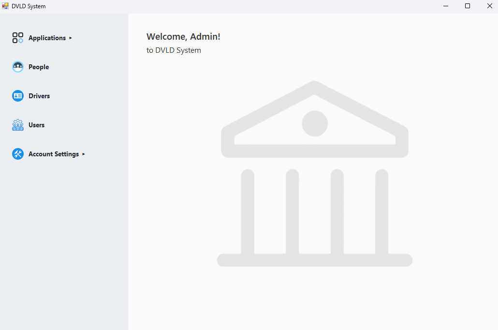

### 🔹 Applications Menu (Expanded)

  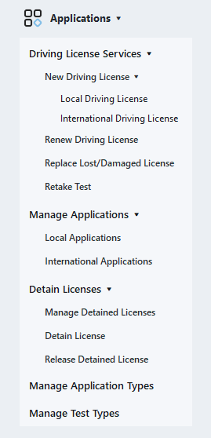

### 🔹 System Management
| 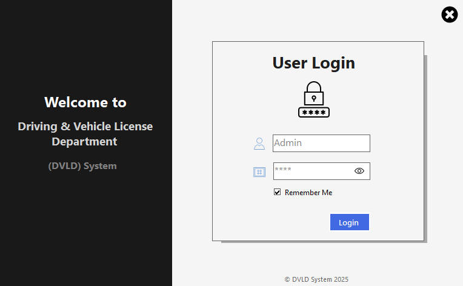 | 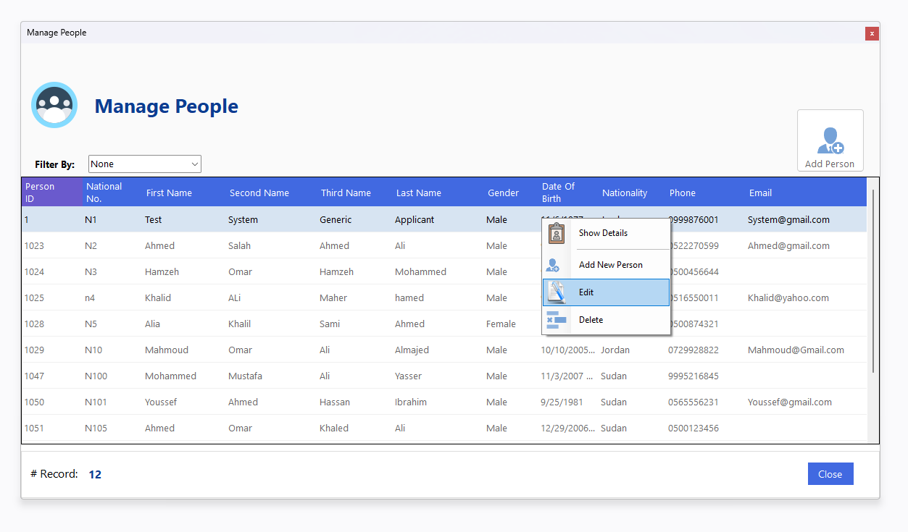 | 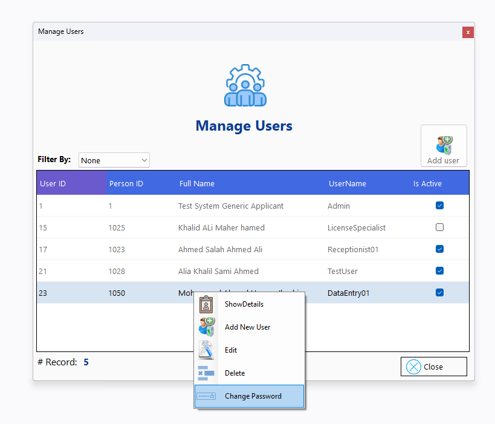 |
|:---:|:---:|:---:|
| **Login Screen** | **People Management** | **Users Management** |
| 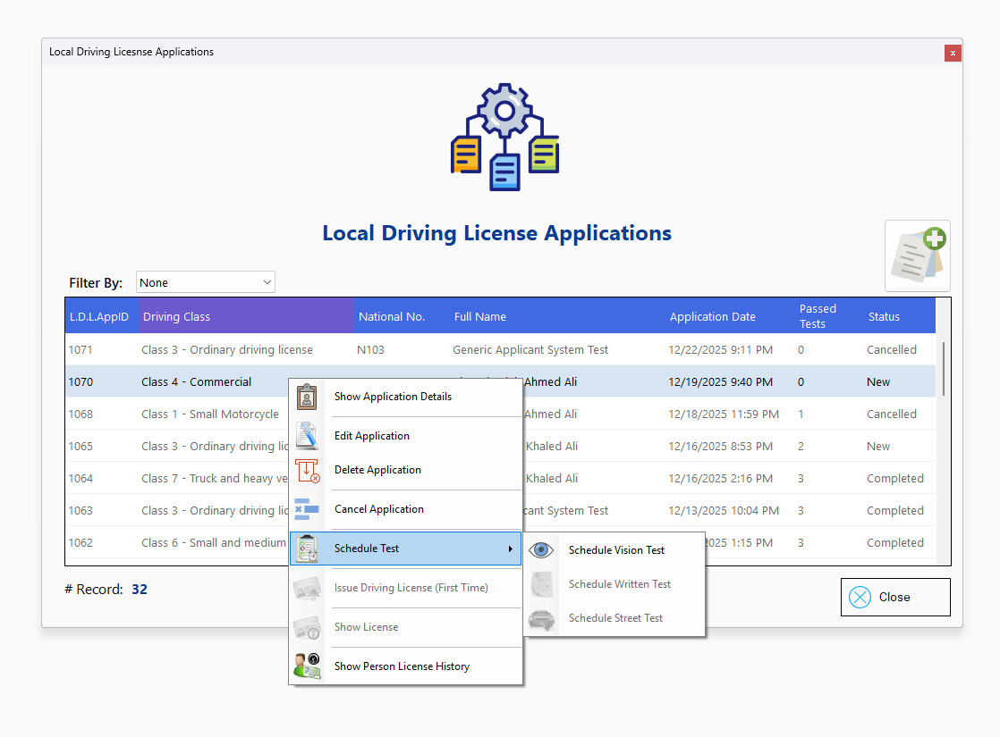 | 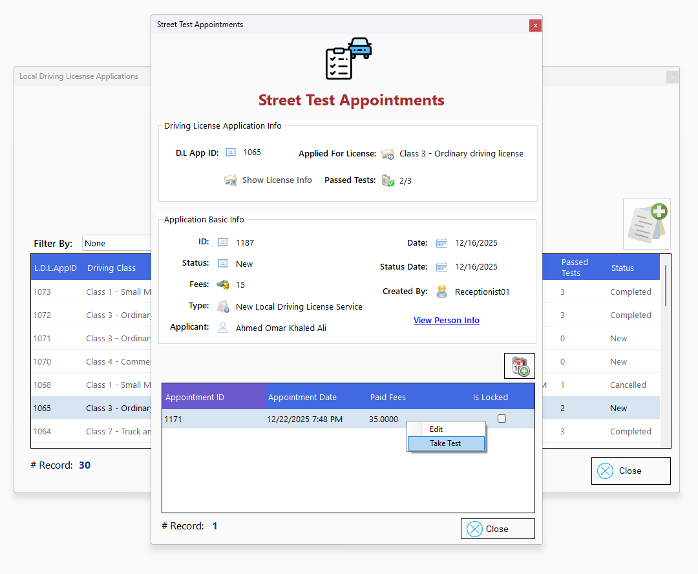 | 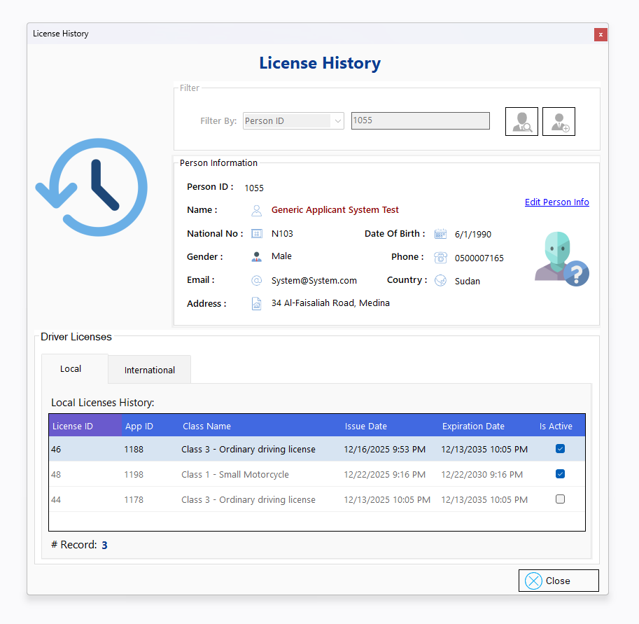 |
| **Local Applications** | **Tests & Appointments** | **License History** |

  
<b>Click to view more screenshots (4+ more)</b>

   
  

    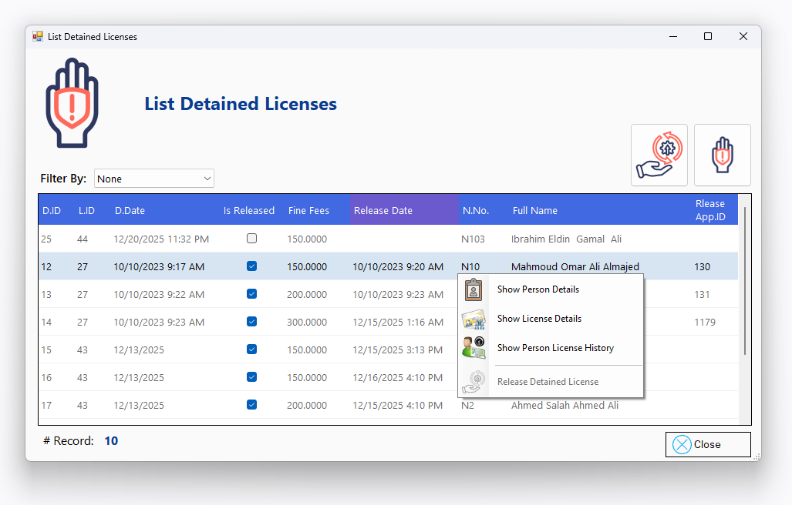
    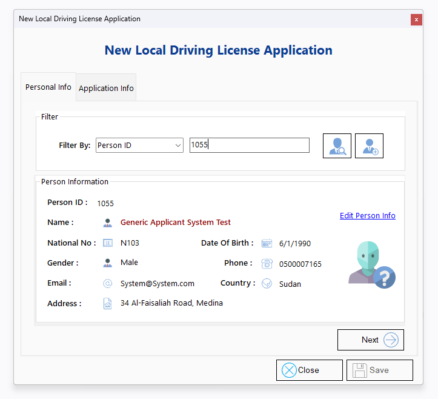
    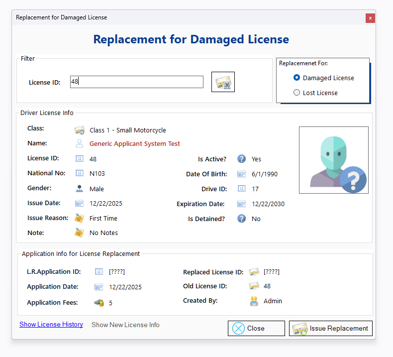
  

   

    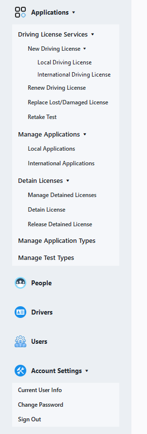
  

---

## ◈ 4. Key Features

* **People & Users Management:** Manage personal records, user accounts, and secure login settings.
* **Application Services**
  * Full support for Local and International license types.
  * Handle first-time issuance based on passing all required tests.
  * Simplified workflows for License Renewal and Replacements (Lost/Damaged).
  * Flexible configuration for application types and test fees.
* **Tests & Appointments**
  * End-to-end scheduling for Vision, Written, and Practical tests.
  * Real-time result tracking and status updates.
  * Dynamic re-take logic for failed attempts.
* **Driver Profiles:** Automatic tracking of driver identities with a detailed history of all issued, active, and expired licenses.
* **Detain & Release:** Manage detained licenses, record violations, and process release workflow after settling requirements. 

## ◈ 5. Technology Stack

- **Framework:** C# / .NET Framework 4.8
- **Database:** Microsoft SQL Server
- **Architecture:** 3-Tier Architecture (Data, Business, and Presentation Layers)
- **Data Access:** ADO.NET
- **UI:** Windows Forms (WinForms)

## ◈ 6. Technical Highlights
- **Modular Design:** Divided into logical modules (People, Users, Applications, etc.) for easier maintenance.
- **Logic Integration:** Implemented solid validation rules and multi-stage workflows to ensure data integrity across the system.
- **Git Best Practices:** Clean and traceable feature-based commit history.

## ◈ 7. Installation and Setup

1. **Database:** Restore `Database/DVLD-System-Database.bak` via SSMS.
2. **Run:** Open the `.sln` file and press **F5**.

> **Note:** If the connection fails, update `Data Source` in `App.config` to match your SQL Server name (e.g., `.` or `.\SQLEXPRESS`).

## ◈ 8. Skills & Learnings

For more details on skills gained during this project, see: [DVLD_SKILLS.md](DVLD_SKILLS.md)

> This project represents a major milestone in my transition from Civil Engineering to Software Development.

